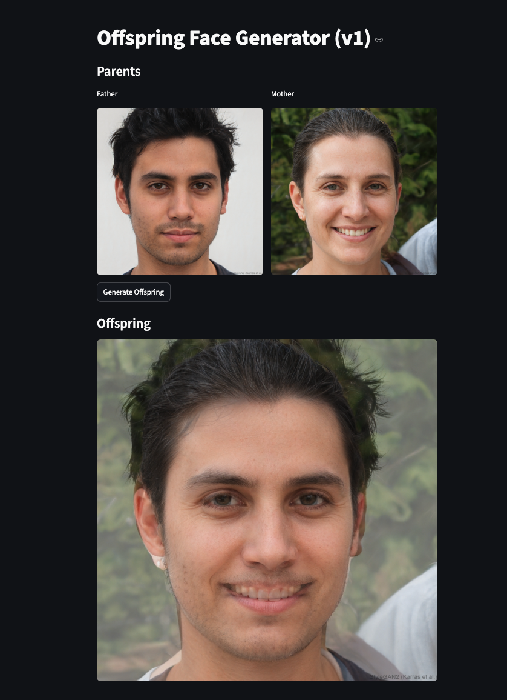

# Offspring Face Generator

A beginner-friendly AI demo web app: randomly selects a "father" and "mother" face (from AI-generated images), and blends their features to create a synthetic "offspring" face by pixelwise image averaging.

---
**[👉 Click here to try the Offspring Face Generator live!](https://offspring-face-generator-gqb9ozsbse6hswgcf6ynkk.streamlit.app/)**
---

## Features

- Randomly picks two parents (male/female) from provided image folders
- Generates an "offspring" face by blending both parents
- Built with Streamlit for an easy web UI

## How to Run

1. **Install requirements**  
   ```
   pip install -r requirements.txt
   ```
2. **Add Your Images**  
   - Place at least 1 image in each: `faces/male/`, `faces/female/`  
   - Use `.jpg` or `.png` files (AI-generated faces recommended)
3. **Start the app**  
   ```
   streamlit run app.py
   ```

## Notes

- This project is for educational, non-commercial use
- No real faces are included in this repo.
- You can easily extend it by improving the blending logic, UI, or enabling user uploads.

## Example



## Technologies Used

- [Streamlit](https://streamlit.io/) &mdash; for rapid web app development in Python
- [Pillow (PIL)](https://python-pillow.org/) &mdash; for image loading/manipulation
- [OpenCV](https://opencv.org/) &mdash; for image processing and future extensions
- [NumPy](https://numpy.org/) &mdash; for image array operations
- Python 3.8+


## Credit

- Face image concept loosely inspired by open source AI image and face blending experiments.
- Face samples obtained from [thispersondoesnotexist.com](https://thispersondoesnotexist.com) (AI-generated).
- This project was created as a portfolio and learning exercise.

## License

This project is licensed under the MIT License.  
See the [LICENSE](LICENSE) file for details.

---